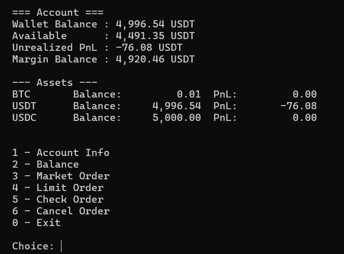

# binancetradebot

A simple Binance Futures Testnet trading bot built with Python.

> For educational purposes only. Do not use with real funds.

---

## Features

- Place MARKET orders
- Place LIMIT orders
- BUY and SELL support
- Interactive CLI menu
- Direct CLI commands
- Order status checking
- Cancel open orders
- Account information
- Balance checking
- Input validation
- Error handling
- Logging support

---

## Screenshot



---

## Project Structure

```text
binancetradebot/
│
├── bot/
│   ├── __init__.py
│   ├── client.py
│   ├── orders.py
│   ├── validators.py
│   └── logging_config.py
│
├── logs/
│   └── trading_bot.log
│
├── screenshots/
│   └── Tradebot.png
│
├── cli.py
├── .env.example
├── requirements.txt
├── README.md
└── .gitignore
```

---

## Requirements

- Python 3.9+
- Binance Futures Testnet account
- Binance Testnet API keys

---

## Setup

### 1. Clone Repository

```bash
git clone https://github.com/ItsMeNikk/BinanceTradebot.git
cd BinanceTradebot
```

---

### 2. Create Virtual Environment

#### Windows

```bash
python -m venv venv
venv\Scripts\activate
```

#### macOS/Linux

```bash
python3 -m venv venv
source venv/bin/activate
```

---

### 3. Install Dependencies

```bash
pip install -r requirements.txt
```

---

### 4. Configure Environment Variables

Copy the example environment file:

#### Windows

```bash
copy .env.example .env
```

#### macOS/Linux

```bash
cp .env.example .env
```

Then add your Binance Futures Testnet API credentials inside `.env`.

Example:

```env
BINANCE_API_KEY=your_api_key
BINANCE_SECRET_KEY=your_secret_key
```

---

## Binance Futures Testnet

Create your Binance Futures Testnet account and API keys here:

https://testnet.binancefuture.com

---

## Run the Application

The application supports both interactive mode and direct CLI commands.

---

## Interactive Menu Mode

```bash
python cli.py
```

---

## CLI Commands

### MARKET Order

```bash
python cli.py market BTCUSDT BUY 0.01
```

---

### LIMIT Order

```bash
python cli.py limit BTCUSDT SELL 0.05 50000
```

---

### Check Order Status

```bash
python cli.py status BTCUSDT 12345678
```

---

### Cancel Order

```bash
python cli.py cancel BTCUSDT 12345678
```

---

### Account Information

```bash
python cli.py account
```

---

### Balance Information

```bash
python cli.py balance
```

---

## Logging

All API requests, responses, and errors are logged inside:

```text
logs/trading_bot.log
```

---

## Error Handling

The application handles:

- Invalid user inputs
- Binance API exceptions
- Network failures
- Missing environment variables
- Invalid symbols/orders

---

## Technologies Used

- Python 3
- python-binance
- argparse
- logging
- python-dotenv

---

## Assumptions

- Only Binance Futures Testnet is supported
- Only USDT-M Futures trading is implemented
- API keys are stored securely using environment variables
- Internet connection is required

---

## Disclaimer

This project is for educational and assessment purposes only.

Trading cryptocurrencies involves financial risk. Do not use this project with real funds without proper security and testing.

---

## Author

Nikhil

GitHub:
https://github.com/ItsMeNikk
